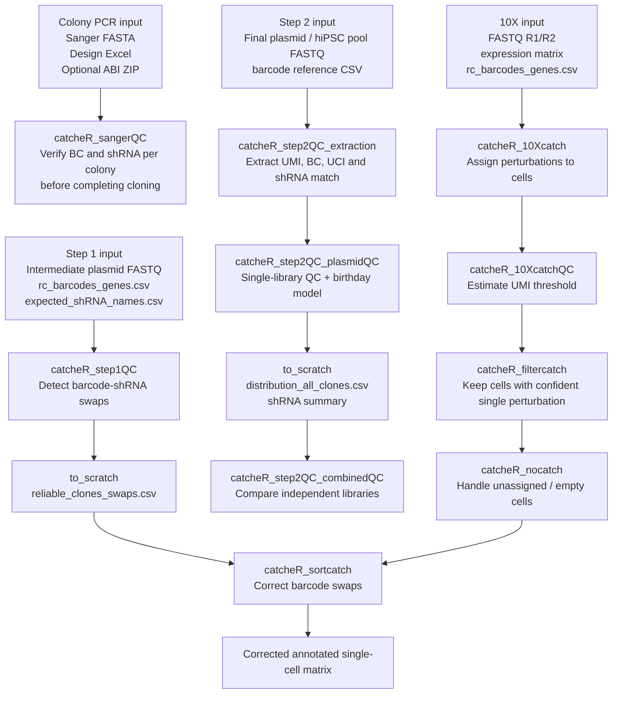

# catcheR

**Clonality And Treatment Controlled shRNA Effect findeR**

`catcheR` is an R package for iPS2-seq / CATCHER experiments. It provides native, non-Docker wrappers for plasmid-pool quality control, 10X single-cell perturbation assignment, assignment-threshold QC, filtering, empty-cell recovery, and barcode-swap correction.

This repository is an updated implementation of the original [`alessandro-bertero/catcheR`](https://github.com/alessandro-bertero/catcheR) workflow, adapted to run directly on local machines or HPC/server environments without Docker wrappers.

---

Full dockerized version on Rstudio server is available from image hedgelab/rstudio-hedgelab:iPS2seq_CIRI_new_cellranger9

To run the Docker by command line:
```bash
docker run -d -p 8080:8787 --privileged=true --name container_name hedgelab/rstudio-hedgelab:iPS2seq_CIRI_new_cellranger9
docker exec -it container_name /bin/bash
```

To run the Docker in Rstudio server:
Note that USER and PASSWORD are the credential for Rstudio
```bash
docker run -d -itv /path/to/shared/folder:/scratch \

  --privileged=true \

  -p 8080:8787 \

  -e USER=rstudio \

  -e PASSWORD=your_password_here \

  --name container_name \

  hedgelab/rstudio-hedgelab:iPS2seq_CIRI_new_cellranger9

docker exec -idt container_name rstudio-server start
```
go on browser http://localhost:8080/ and add the credentials

## What catcheR does

In iPS2-seq, each perturbation is represented by a linked molecular identity:

- **shRNA**: perturbation sequence targeting a gene.
- **BC / barcode**: short sequence associated with a specific shRNA.
- **UCI**: unique clonal identifier generated during the PCR/cloning strategy.
- **UMI**: molecular identifier used in single-cell sequencing data to remove PCR duplicates.
- **Clone**: usually represented as a barcode + UCI combination.

The package covers the core CATCHER workflow:

1. QC of intermediate plasmid pools to detect barcode-shRNA swaps.
2. QC of final plasmid or edited hiPSC pools to assess shRNA representation.
3. Assignment of shRNA perturbations to 10X single-cell transcriptomes.
4. QC and threshold selection for perturbation assignment.
5. Filtering cells assigned to a single perturbation.
6. Recovering unassigned / empty cells when appropriate.
7. Correcting barcode swaps in the final single-cell matrix.

---

## Pipeline overview



---

## Installation

Install from GitHub:

```r
install.packages("devtools")
devtools::install_github("ebalmas/catcheR")
```

Load the package:

```r
library(catcheR)
```

Recommended R packages:

```r
install.packages(c(
  "ggplot2", "dplyr", "tidyr", "scales", "forcats",
  "patchwork", "data.table", "quantmod", "readxl"
))
```

Python 3 is required for `catcheR_step2QC_extraction()`.

---

## Recommended project organization

A reproducible analysis folder can be organized like this:

```text
project/
  scripts/
    n00_import.Rmd
    n01_QC.Rmd
    n02_catcher.Rmd
  scratch/
    # temporary input files copied from to_scratch/ when restarting from checkpoints
  Output/
    step1QC/
    step2QC_extraction/
    step2QC_plasmidQC/
    step2QC_combinedQC/
    10Xcatch/
    10XcatchQC/
    filtercatch/
    nocatch/
    sortcatch/
```

Each function writes a date-stamped run folder:

```text
Output/<function>/YYMMDD_<function>_<sample>/
  csv/          # tables
  plots/        # figures as PDF/JPG
  stats/        # text reports
  R_objects/    # .rds objects, including the full returned result list
  to_scratch/   # files needed by the next pipeline step
```

Example:

```text
Output/step2QC_plasmidQC/260518_step2QC_plasmidQC_CATCHER2/
  csv/
  plots/
  stats/
  R_objects/
  to_scratch/
```

---

## Core functions

| Function | Purpose | Main output |
|---|---|---|
| `catcheR_sangerQC()` | **Colony PCR Sanger QC** — verify BC and shRNA per colony before completing intermediate plasmid cloning | Per-well pass/fail table with mutation calls and quality scores |
| `catcheR_step1QC()` | Intermediate plasmid pool QC; detects barcode-shRNA swaps | reliable clone/swap tables and QC plots |
| `catcheR_step2QC_extraction()` | Extracts UMI, barcode, UCI and barcode match from final-pool FASTQ | `distribution_all_clones.csv` and extraction tables |
| `catcheR_step2QC_plasmidQC()` | Single-library final plasmid / hiPSC pool QC | shRNA representation, clone frequency plots, birthday-model estimates |
| `catcheR_step2QC_combinedQC()` | Compares two independent final libraries | overlap, reproducibility and go/no-go summary |
| `catcheR_10Xcatch()` | Assigns perturbations to 10X single-cell transcriptomes | annotated silencing matrix and intermediate assignment files |
| `catcheR_10XcatchQC()` | Explores UMI/UCI distributions and estimates UMI threshold | threshold file and QC plots |
| `catcheR_filtercatch()` | Filters cells to confident single-perturbation assignments | filtered silencing matrix |
| `catcheR_nocatch()` | Processes unassigned / empty cells | complete matrix and all-sample summaries |
| `catcheR_sortcatch()` | Corrects barcode-swap assignments using step1QC output | corrected annotated matrix |

---

## Colony PCR Sanger QC — before completing the intermediate cloning

Use `catcheR_sangerQC()` **during the intermediate plasmid cloning stage**,
after picking bacterial colonies from the ligation plate and before
completing the transfer into the final backbone. This step confirms, per
colony, that:

- The insert was cloned successfully (anchor and restriction sites present).
- The **barcode (BC)** matches the expected BC for that well in your design plate.
- The **shRNA** sense and antisense sequences match the design, with no
  point mutations introduced during oligo synthesis or ligation.
- The **hairpin structure** is valid (sense = reverse complement of antisense).

This is distinct from `catcheR_step1QC()`, which analyses the full
intermediate *pool* FASTQ and works at scale. `catcheR_sangerQC()` is
specifically for the per-colony Sanger sequencing check done on a 96-well
plate before you invest time completing the cloning.

**When to use this:**

- After picking colonies from a test ligation to compare conditions (e.g.
  1:12 vs 1:20 insert:vector ratio).
- To confirm that at least a subset of colonies have the correct insert before
  proceeding to pool sequencing.
- To catch synthesis errors or unexpected sequence variants before they are
  propagated through the library.

**Required files:**

```text
<FASTA file>                  Sanger reads, one per well (headers end in _A1, _B1, etc.)
<Design Excel>                The oligo design file used to order your library
<ABI/PHD ZIP> (optional)      ZIP of ABI output files; enables per-base quality reporting
```

**Example:**

```r
result <- catcheR_sangerQC(
  fasta           = "11109801799-1.fasta",
  design_xlsx     = "EB003C_DES01_shRNA_tdark_Ligation.xlsx",
  output_dir      = "Output/",
  sample_name     = "plate1_ligation",
  plate_sheet     = "Plate 01",
  ligation_split  = 6L,                   # cols 1-6 = 1:12, cols 7-12 = 1:20
  ligation_labels = c("1:12", "1:20"),
  abi_zip         = "11109801799-1_SCF_SEQ_ABI.zip"
)

# View per-well results
result$results

# Summary counts per status
result$summary

# Passing wells only
result$results[grepl("^PASS", result$results$status), ]

# Reload without re-running
result <- readRDS(
  "Output/sangerQC/260518_sangerQC_plate1_ligation/R_objects/sangerQC_result.rds"
)
```

**Status codes at a glance:**

| Status | Meaning |
|--------|---------|
| `PASS` | BC and shRNA both match perfectly |
| `PASS (1bp BC mut)` | shRNA perfect; 1 BC mismatch — likely still usable |
| `PASS (2bp BC mut)` | shRNA perfect; 2 BC mismatches — verify BC uniqueness before using |
| `PASS (1bp shRNA mut)` | BC perfect; 1 shRNA mismatch — check seed region |
| `CHECK` | BC matches but shRNA has > threshold mismatches — inspect manually |
| `INVALID HAIRPIN` | Sense ≠ RC(antisense) — do not use this colony |
| `shRNA OK / BC WRONG` | shRNA matches but BC > 2 mm — possible synthesis error |
| `SEQ TRUNCATED` | Read too short or insert not cloned |
| `SEQ FAILED` | Sequencing failed |

See the vignette `vignette("catcheR-sangerQC")` for full documentation
including read orientation, anchor extraction logic, quality score
interpretation, and all parameter options.

---

## Step 1: intermediate plasmid pool QC

Use this step when the read contains both the barcode and the shRNA sequence. It tests whether each barcode is associated with the expected shRNA or whether a barcode-shRNA swap occurred.

Required files in the input folder:

```text
rc_barcodes_genes.csv
expected_shRNA_names.csv
<FASTQ file>
```

Example:

```r
step1 <- catcheR_step1QC(
  folder         = "scratch/step1/",
  fastq.read1    = "intermediate_pool_R1.fastq.gz",
  output_dir     = "Output/",
  sample_name    = "CATCHER_step1",
  DIs            = 100,
  ratio          = 10,
  plot.threshold = 2000
)
```

Important returned objects:

```r
step1$paths$root
step1$paths$to_scratch
step1$paths$R_objects
```

Important files for the next steps:

```text
to_scratch/reliable_clones_swaps_*.csv
```

---

## Step 2A: final plasmid / hiPSC pool extraction

This step runs the bundled Python script `plasmid_final_corrected.py`. It extracts fixed read-position features from the final plasmid or edited-cell pool sequencing data.

By default, the corrected read structure is:

```text
UMI:     first 13 nt
BC:      positions 34-41
UCI:     positions 42-47
```

Example:

```r
extract <- catcheR_step2QC_extraction(
  fastq      = "scratch/final_pool_R1.fastq.gz",
  barcodes   = "scratch/rc_barcodes_genes.csv",
  output_dir = "scratch/step2_extraction/",
  DIs        = 300,
  bc_start   = 34,
  bc_end     = 41,
  uci_start  = 42,
  uci_end    = 47,
  umi_len    = 13
)
```

Main output:

```text
scratch/step2_extraction/distribution_all_clones.csv
```

---

## Step 2B: single-library plasmid / hiPSC pool QC

This step summarizes clone frequencies and shRNA representation after extraction. It also estimates the expected UCI collision/duplication behavior using a birthday-problem model based on the planned number of nucleofected cells and the observed editing/transfection efficiency.

Example:

```r
qc <- catcheR_step2QC_plasmidQC(
  results_dir      = "scratch/step2_extraction/",
  output_dir       = "Output/",
  sample_name      = "CATCHER2",
  DIs              = 300,
  transfect_clones = 100,
  transfect_cells  = 2000000,
  nucleofect_cells = 2000000
)
```

Use results directly in R:

```r
qc$shrna
qc$birthday
qc$plots$histogram
qc$plots$threepanel
qc$summary
```

Reload a previous run:

```r
qc <- readRDS(
  "Output/step2QC_plasmidQC/260518_step2QC_plasmidQC_CATCHER2/R_objects/step2QC_plasmidQC_result.rds"
)
```

Important files for the next step:

```text
to_scratch/distribution_all_clones.csv
to_scratch/shrna_summary_DIs300.csv
```

---

## Step 2C: compare two independent libraries

Use this after running extraction and plasmid QC for two independent CATCHER libraries.

```r
combined <- catcheR_step2QC_combinedQC(
  lib1_dir         = "scratch/CATCHER1/",
  lib2_dir         = "scratch/CATCHER2/",
  output_dir       = "Output/",
  sample_name      = "CATCHER1_CATCHER2",
  lib1_name        = "CATCHER1",
  lib2_name        = "CATCHER2",
  DIs              = 300,
  transfect_clones = 100,
  transfect_cells  = 2000000,
  nucleofect_cells = 2000000
)
```

Returned objects:

```r
combined$summary
combined$overlap
combined$plots
combined$paths
```

---

## Step 3: assign perturbations in 10X single-cell data

`catcheR_10Xcatch()` assigns shRNA perturbations to cells using the 10X FASTQ files, the gene-expression matrix, and the barcode reference.

Required files in `folder`:

```text
<FASTQ R1>
<FASTQ R2>
<expression matrix>
rc_barcodes_genes.csv
```

Example:

```r
catch <- catcheR_10Xcatch(
  folder            = "scratch/10X/",
  fastq.read1       = "sample_R1.fastq.gz",
  fastq.read2       = "sample_R2.fastq.gz",
  expression.matrix = "matrix.csv",
  reference         = "GGCGCGTTCATCTGGGGGAGCCG",
  UCI.length        = 6,
  threads           = 8,
  percentage        = 15,
  mode              = "bimodal",
  ratio             = 5,
  samples           = 1,
  x                 = 100,
  y                 = 400
)
```

---

## Step 4: 10X assignment QC and UMI-threshold selection

Run this when you want to inspect the assignment distributions and estimate the UMI threshold separately.

```r
qc10x <- catcheR_10XcatchQC(
  folder      = "scratch/10X/",
  output_dir  = "Output/",
  sample_name = "AB017",
  reference   = "GGCGCGTTCATCTGGGGGAGCCG",
  mode        = "bimodal",
  samples     = 1,
  x           = 100,
  y           = 400
)
```

Important file for the next step:

```text
to_scratch/UMI_threshold.txt
```

---

## Step 5: filter assigned cells

```r
filtered <- catcheR_filtercatch(
  folder            = "scratch/10X/",
  output_dir        = "Output/",
  sample_name       = "AB017",
  expression.matrix = "matrix.csv",
  reference         = "GGCGCGTTCATCTGGGGGAGCCG",
  threshold         = 5,
  ratio             = 5,
  samples           = 1,
  UMI.count         = NULL
)
```

If `UMI.count = NULL`, the function attempts to use `UMI_threshold.txt` generated by `catcheR_10XcatchQC()`.

---

## Step 6: handle unassigned / empty cells

```r
nocatch <- catcheR_nocatch(
  folder            = "scratch/10X/",
  output_dir        = "Output/",
  sample_name       = "AB017",
  expression.matrix = "matrix.csv",
  reference         = "GGCGCGTTCATCTGGGGGAGCCG",
  threshold         = 5,
  samples           = 1,
  merge.samples     = TRUE
)
```

---

## Step 7: barcode-swap correction

Use the swap table produced by `catcheR_step1QC()` to correct the annotated single-cell matrix.

```r
corrected <- catcheR_sortcatch(
  folder      = "scratch/sortcatch/",
  matrix      = "silencing_matrix.csv",
  swaps       = "reliable_clones_swaps_100_10.csv",
  output_dir  = "Output/",
  sample_name = "AB017"
)
```

Main output:

```text
to_scratch/silencing_matrix_updated.csv
```

Returned object:

```r
corrected$matrix
corrected$swaps
corrected$paths
```

---

## Checkpoint workflow with `to_scratch/`

Every major function writes files needed by the next step into `to_scratch/`. To restart from a checkpoint:

```bash
mkdir -p scratch/
cp Output/step2QC_plasmidQC/260518_step2QC_plasmidQC_CATCHER2/to_scratch/* scratch/
```

Then use `scratch/` as the input folder for the next function.

---

## Notes on matched and unmatched clones

In the final-pool QC, clones are considered **matched** when their barcode exactly matches an entry in `rc_barcodes_genes.csv`. Clones are **unmatched** when the extracted barcode is not present in the reference file. Unmatched clones can arise from sequencing errors, unexpected plasmids, reference-table omissions, or shifted/malformed reads.

The matching step is exact by default. A one-base difference in the barcode is not treated as a match.

---

## Development workflow

Create a new branch before updating the package:

```bash
git checkout -b update-readme-and-pipeline-docs
```

Replace the README:

```bash
cp README_catcheR_updated.md README.md
git add README.md
git commit -m "Update README with full catcheR pipeline"
git push -u origin update-readme-and-pipeline-docs
```

Then open a pull request on GitHub.

---

## Requirements

- R >= 4.0.0
- Python 3.6+ (for `catcheR_step2QC_extraction()`)
- R packages: ggplot2, dplyr, tidyr, scales, forcats, patchwork, data.table


## Citation and background

This package is a modified version of the the iPS2-seq / catcheR workflow described in the supplementary protocol for Balmas et al. "single-cell transcriptional perturbome analysis in pluripotent stem cell models." Embo Molecular System Biology 2026, Vol 22 Pag 179-227.
https://link.springer.com/article/10.1038/s44320-025-00172-8#Sec13 

The new package is designed to be flexible and adaptable to various experimental designs.
The step2QC functions are specific to the new optimized iPS2seq pipeline cloning platform.
